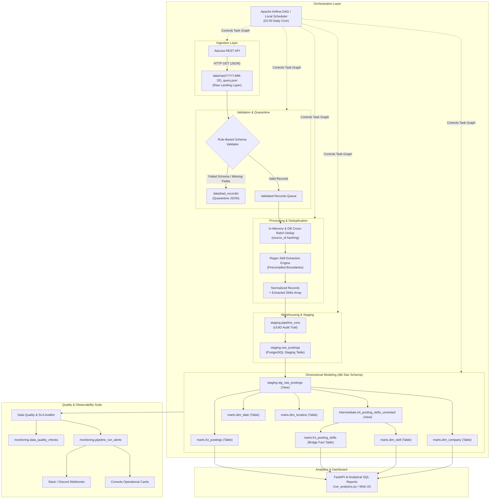
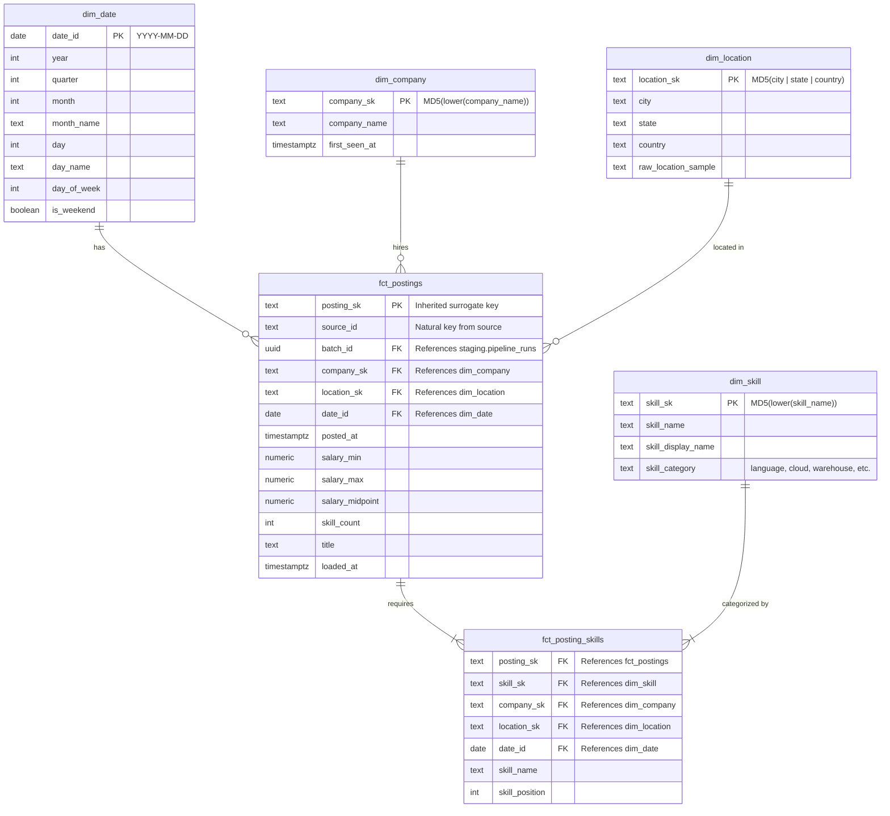

# Architecture & Technical Deep-Dive
## Skills Demand Intelligence Platform

---

## 1. System Overview

The **Skills Demand Intelligence Platform** is an end-to-end, production-grade data engineering platform. It continuously extracts job postings from external job board APIs (Adzuna), validates and sanitizes incoming semi-structured payloads, deduplicates postings across daily batch runs, extracts tech skills from unstructured free-text descriptions using regex pattern matching against a curated taxonomy, models data into an analytics-ready Star Schema using dbt in PostgreSQL, orchestrates execution via Apache Airflow, and enforces data observability through an 11-assertion automated data quality engine with multi-channel alerting.

---

## 2. End-to-End Pipeline Architecture



---

## 3. Dimensional Data Model (Star Schema ERD)

To eliminate duplication and allow flexible slicing across skill, company, geography, and time, the analytical layer is modeled as a Kimball-style **Star Schema with a Many-to-Many Bridge Table**:



---

## 4. Key Design Decisions & Trade-Offs

### 1. ELT vs. ETL Landing Pattern
- **Decision:** Land untouched raw JSON responses directly in `data/raw/` before any parsing.
- **Trade-off:** Uses modest disk space (~1-2 MB per 1,000 postings).
- **Rationale:** If validation rules or skills taxonomy change later, raw data can be re-parsed without re-fetching from rate-limited external APIs.

### 2. Deterministic MD5 Surrogate Keys vs. Serial Auto-Increment IDs
- **Decision:** Dimensions use `MD5(LOWER(TRIM(natural_key)))` as surrogate primary keys.
- **Trade-off:** 32-character string keys require slightly more storage than 4-byte integers.
- **Rationale:** MD5 hashing produces **deterministic keys across idempotent rebuilds**. Running `dbt run` 50 times produces the exact same surrogate key for `"Google"` or `"Snowflake"`. A database sequence (`SERIAL`) would increment on every truncate/rebuild, invalidating downstream foreign keys.

### 3. Many-to-Many Bridge Table (`fct_posting_skills`) vs. Array Aggregations
- **Decision:** Decompose skills arrays into a bridge fact table connecting `fct_postings` and `dim_skill`.
- **Trade-off:** Bridge table has multiple rows per posting.
- **Rationale:** Enables standard relational joins, indexing, and high-performance aggregations (e.g. self-joining to generate tech stack co-occurrence pairs, calculating market penetration percentages, and computing average salary by skill) without needing database-specific unnest operators in every analytical query.

### 4. Cross-Batch Deduplication & Idempotency
- **Decision:** Deduplicate against existing database records using natural key `source_id` before loading, with a secondary constraint `UNIQUE (source_id, pull_batch_id)` in `staging.raw_postings` and `DISTINCT ON (source_id) ORDER BY loaded_at DESC` in `marts.fct_postings`.
- **Trade-off:** Slight pre-load index check overhead.
- **Rationale:** Eliminates duplicate counting while preserving historical batch traceability.

### 5. Regex Precompilation vs. Heavy NLP Models
- **Decision:** Precompile regex boundary patterns `\b(?:apache\s*)?airflow\b` against a curated 30-skill taxonomy.
- **Trade-off:** Does not extract unlisted emergent technologies until added to taxonomy.
- **Rationale:** Extreme speed (processing 1,000 postings takes <0.15s), zero external GPU/cloud dependencies, and zero hallucination risk compared to LLMs.

---

## 5. Automated Data Quality & Observability Architecture

The platform embeds automated quality gates across every execution:

```
Pipeline Run
    │
    ▼
[Tasks 1-4: Extract → Validate → Process → Load]
    │
    ▼
[Task 5: dbt Run & Test (32 Schema Assertions)]
    │
    ▼
[Task 6: Data Quality & Observability Suite (11 Checks)]
    ├── Freshness SLA (<= 24h)
    ├── Volume Anomaly (< 40% of rolling avg)
    ├── Quarantine Rejection Rate (<= 15%)
    ├── Zero-Skills Drift Rate (<= 85%)
    ├── Column Completeness (Title 0% null, Company < 15%)
    └── Referential Integrity (0 orphan keys)
    │
    ▼
[Multi-Channel Alert Dispatcher]
    ├── Persist to monitoring.data_quality_checks
    ├── Render ASCII console summary card
    └── Dispatch Webhook to Slack & Discord (if configured)
```
